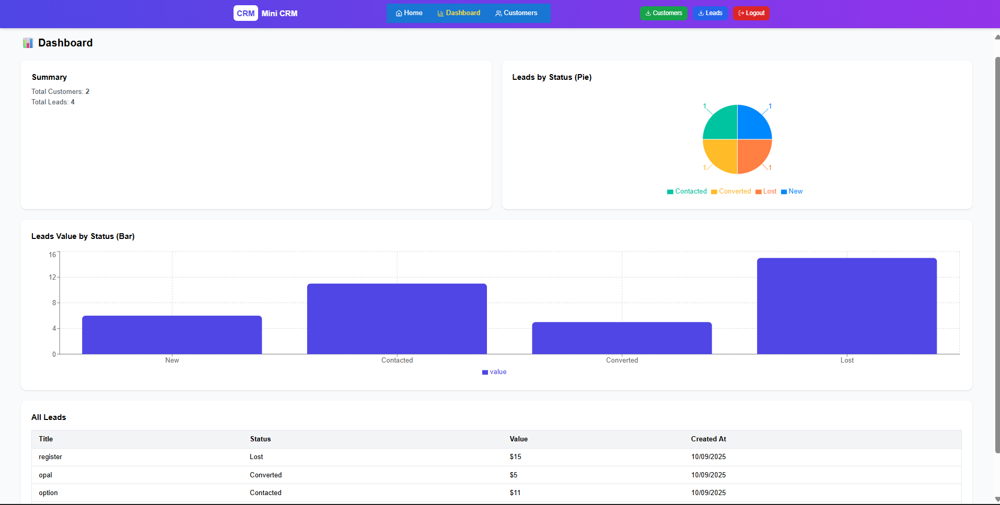
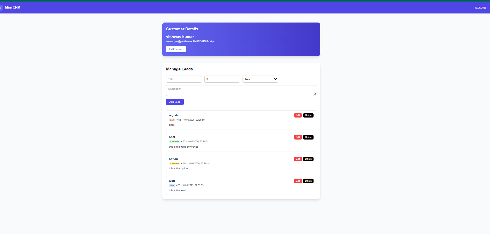

# Mini CRM Application (MERN)

A **Mini CRM (Customer Relationship Management)** web application built with the **MERN stack** (MongoDB, Express.js, React.js, Node.js).
This project was developed as part of the **Full Stack Developer Assignment** for **Dev Innovations Labs**.

---

## 🚀 Quick summary

This Mini-CRM provides:

* User **Registration** & **Login** (JWT + bcrypt)
* Role support: `user` (default on register) and `admin` (created via seed script)
* Customer management (add / list / update / delete, pagination + search)
* Leads per customer (create / update / delete, statuses, value)
* Dashboard with charts (Pie + Bar) for lead status & values
* Professional, responsive UI (TailwindCSS) with improved UX:

  * Global sticky navbar, mobile hamburger, download buttons
  * Toast notifications (sonner)
  * Form validation using **Yup + React Hook Form**
  * International phone input with flags
  * Seed script to create an admin user in the DB

---

## 📂 Project structure

```
Mini-CRM/
├── backend/           # Express API (Node.js)
│   ├── src/
│   │   ├── models/
│   │   ├── routes/
│   │   └── ...
│   ├── seedAdmin.js   # seed admin script
│   └── package.json
├── frontend/          # React app (Vite / CRA)
│   ├── src/
│   │   ├── pages/
│   │   ├── components/
│   │   └── ...
│   └── package.json
├── screenshots/       # demo screenshots (referenced in README)
└── README.md
```

---

## 🔧 Local setup (development)

### 1. Clone the repo

```bash
git clone https://github.com/your-username/mini-crm.git
cd mini-crm
```

### 2. Backend setup

```bash
cd backend
npm install
```

Create a `.env` file in `backend/` with these variables:

```
PORT=5000
MONGO_URI=your_mongodb_atlas_connection_string
JWT_SECRET=your_jwt_secret
```

Run backend (dev):

```bash
npm run dev
# or if you don't have a script: node src/index.js
```

**Seed an admin user** (optional — creates an admin account so you can test admin-only behaviour):

1. Put `seedAdmin.js` at `backend/seedAdmin.js` (next to `package.json`).
2. The file should `require('./src/models/User')` — i.e. path relative to `backend/`.
3. From inside the `backend` folder run:

```bash
node seedAdmin.js
```

It will create an admin account (email/password printed to console). If you placed `seedAdmin.js` somewhere else, run it from the folder where `./src/models/User` resolves.

> **Note:** The app registers users with role=`user` by default. Only use `seedAdmin.js` (or admin-only API) to create `admin` users. Do **not** expose role selection on the public register page.

### 3. Frontend setup

Open a new terminal:

```bash
cd frontend
npm install
npm start
```

Frontend default URL: `http://localhost:3000`
Backend default URL: `http://localhost:5000`

---

## ✅ Routing / UX notes (what we changed)

* **Public pages**

  * `GET /` → **Home** page:

    * Gradient background (indigo → purple → pink)
    * Hero section: title, tagline, call-to-action buttons (Get Started, Login)
    * Features section (Customer Management, Leads Tracking, Secure Auth)
    * Testimonials section
    * Footer with © year + social links
    * Fully responsive with mobile hamburger menu in navbar

  * `GET /login` → Login page

  * `GET /register` → Registration page

* **Protected pages** (require JWT / login)

  * `/dashboard` → Dashboard (summary + charts)
  * `/customers` → Customers list (add / view / delete)
  * `/customers/:id` → Customer detail (edit customer, manage leads)

* **Navbar / Layout**

  * Sticky, responsive **global navbar**:

    * Items: Home, Dashboard, Customers
    * Download buttons for Customers & Leads (CSV/JSON client-side)
    * Logout button with toast feedback
    * Hamburger menu on mobile view

* **Default auth behaviour**

  * **Register** creates a user with role: `user`.
  * **Admin** users should be created by the seed script (`seedAdmin.js`).
  * This prevents anyone from making themselves an admin from the public UI.

---

## 🧾 API (high-level)

**Auth**

* `POST /api/auth/register` → register (returns token + user)
* `POST /api/auth/login` → login (returns token + user)

**Customers**

* `GET /api/customers` → list (pagination & search)
* `POST /api/customers` → create
* `GET /api/customers/:id` → details (includes leads)
* `PUT /api/customers/:id` → update
* `DELETE /api/customers/:id` → delete

**Leads** (under customer)

* `GET /api/leads/:customerId/leads`
* `POST /api/leads/:customerId/leads`
* `PUT /api/leads/:customerId/leads/:leadId`
* `DELETE /api/leads/:customerId/leads/:leadId`

---

## ✨ UX / Frontend improvements included

* **Home page** with gradient background, hero, features, testimonials, footer
* **Reactive validation** using React Hook Form + Yup
* **Phone input** with flags & country code (react-phone-input-2)
* **Toasts** for actions (sonner)
* **Responsive design** with TailwindCSS
* **Download buttons** in navbar (Customers / Leads)
* **Dashboard charts** using Recharts

---

## ⚙️ How to seed admin (exact steps)

1. Put `seedAdmin.js` in `backend/` (top-level inside backend folder). Example `backend/seedAdmin.js`:

```js
// backend/seedAdmin.js
const mongoose = require('mongoose');
const bcrypt = require('bcryptjs');
const dotenv = require('dotenv');
dotenv.config();

const User = require('./src/models/User'); // must resolve from this file

async function seedAdmin() {
  await mongoose.connect(process.env.MONGO_URI);
  const existing = await User.findOne({ email: 'admin@crm.com' });
  if (existing) { console.log('Admin exists'); process.exit(0); }

  const hash = await bcrypt.hash('Admin@123', 10);
  const admin = new User({
    name: 'Admin',
    email: 'admin@crm.com',
    passwordHash: hash,
    role: 'admin',
  });
  await admin.save();
  console.log('Admin created: admin@crm.com / Admin@123');
  process.exit(0);
}

seedAdmin().catch(e => { console.error(e); process.exit(1); });
```

2. From `backend/` run:

```bash
node seedAdmin.js
```

3. Confirm admin login works using the printed credentials.

---

## 📷 Screenshots

> Place your screenshots inside `screenshots/` (folder at repo root). Use the exact filenames you reference below.

### 🔐 Register


### 🔑 Login


### 📊 Dashboard



### 👥 Customers



### 📄 Customer Details


### 🚪 Logout / Toasts


---

## ✅ Development tips / gotchas

* **Do not commit** your `.env` — add it to `.gitignore` (both `backend/.env` and `frontend/.env` if used).
* If you see `cRes.data is not iterable` or unexpected response shapes, check the backend response body. The frontend handles both `{ data: [...] }` and `{ customers: [...] }`.
* Ensure `AuthProvider` is wrapped inside `BrowserRouter` in frontend.
* Make sure `dotenv.config()` is loaded at the top of `seedAdmin.js` and backend entry file.

---

## 📦 Deployment notes (optional)

* **Backend**: Render / Railway / Heroku
* **Frontend**: Vercel / Netlify
* Update `.env` in production with `MONGO_URI` and `JWT_SECRET`
* Set `REACT_APP_API_URL` in frontend for deployed backend

---

## 🧑‍💻 Author

**Ankit Rajput**
Full Stack Developer Candidate – Dev Innovations Labs
